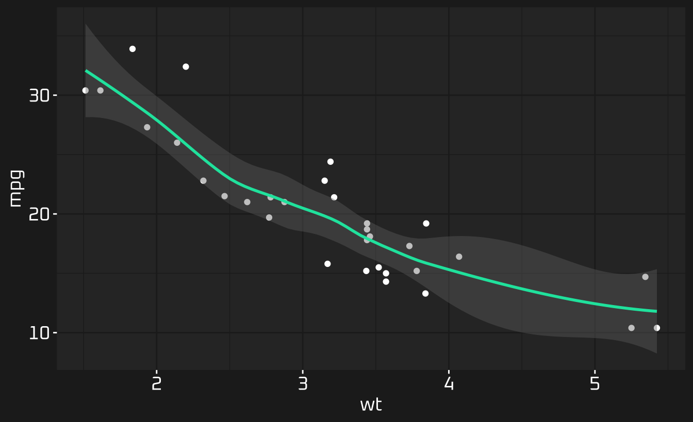
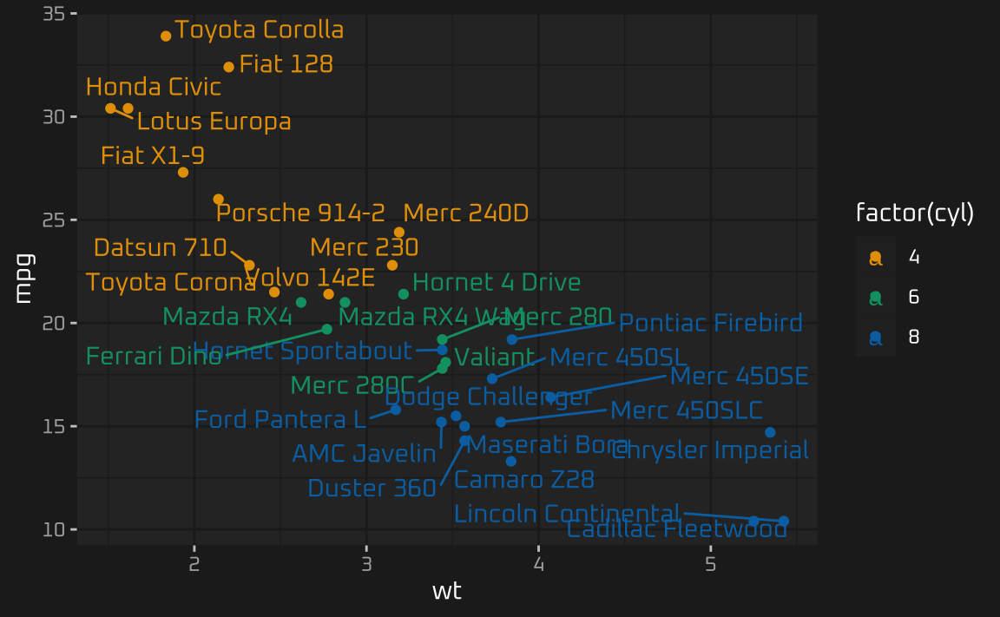
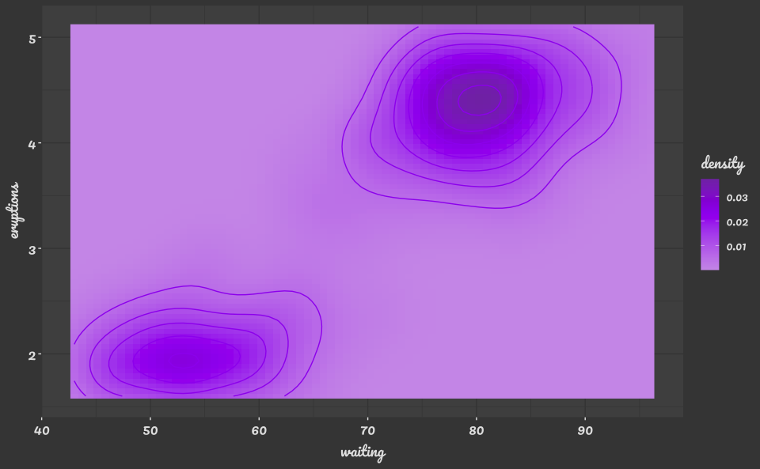
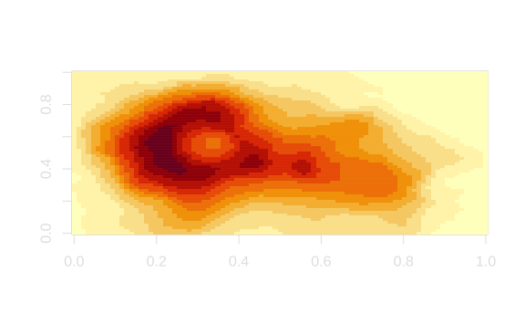
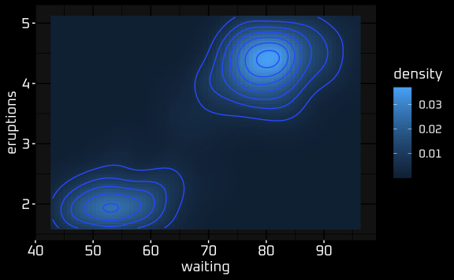
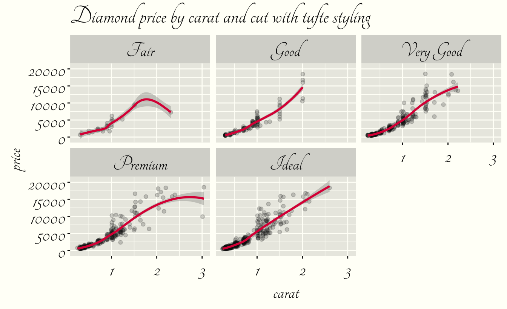
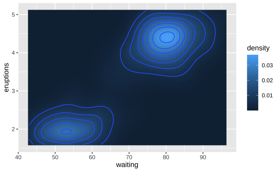
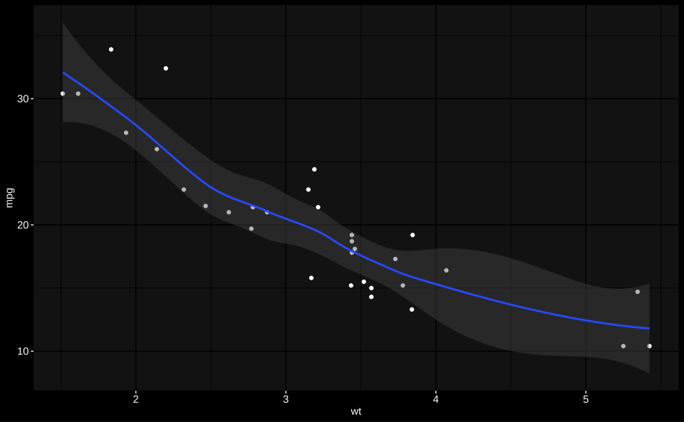
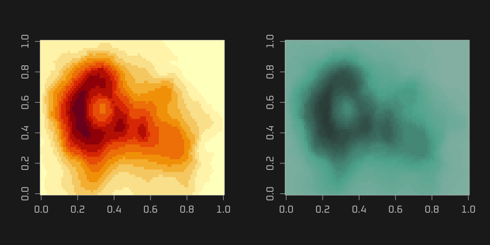
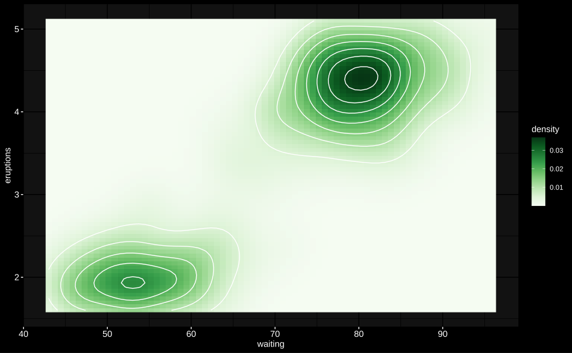

<!-- README.md is generated from README.Rmd. Please edit that file -->

# thematic

<!-- badges: start -->

[](https://CRAN.R-project.org/package=thematic)
[](https://www.tidyverse.org/lifecycle/#experimental)
[](https://travis-ci.org/rstudio/thematic)
[](https://codecov.io/gh/rstudio/thematic?branch=master)
<!-- badges: end -->

Simple and automatic theming of **ggplot2**, **lattice**, and **base**
graphics.

## Installation

**thematic** is not yet available on [CRAN](https://CRAN.R-project.org),
but you can install it now with:

``` r
remotes::install_github("cpsievert/thematic")
library(thematic)
```

## Getting started

**thematic** provides a single entry point to controling the main
colours and fonts of **ggplot2**, **lattice**, and **base** graphics. To
start a (global) theme, give `thematic_begin()` a background, a
foreground, and accent colour, as well as (optionally) a `font_spec()`.
If a [Google Font](https://fonts.google.com) family is requested,
**thematic** attempts to automatically download, cache, and register the
font for use with **showtext** and **ragg** (learn more in [Custom
Fonts](#custom-fonts)). That means, if you have an internet connection
and **showtext** or **ragg** installed, any Google Font “just works”
out-of-the-box in most cases.

``` r
library(thematic)
thematic_begin(
  bg = "#444444", fg = "#e4e4e4", accent = "#A020F0", 
  font = font_spec(family = "Pacifico", scale = 1.25, auto_install = TRUE)
)
```

As you’ll see in the examples below, **thematic** uses these “main”
colours to inform consistent defaults not only for the plot’s overall
theme (e.g., plot/panel background, text colour, etc), but also for
`accent`ed graphical markers (e.g., **ggplot2** geom defaults), as well
as `sequential` and `qualitative` colour scales (these scaling defaults
can also be controlled via `thematic_begin()`). `thematic_begin()` works
by modifying global state in a “permanent” way so that all your future
plots “just work”; thus, best practice is to call `thematic_end()` when
you’re done using **thematic**.

## ggplot2

**thematic** works best with **ggplot2** (partly thanks to **ggplot2**’s
overall design). In a nutshell, **thematic** does the following:

1.  Sets a new “complete” `theme()` default based on `bg`, `fg`, and
    `font`. Since this theme is “complete”, you probably don’t want to
    mix it with other complete themes (e.g., `theme_bw()`), but you can
    definitely override particular aspects with `theme()`.
2.  For each relevant `Geom`, sets new `Geom$default_aes` defaults
    (based on `bg`, `fg`, `accent`, and `font`). Grayscale colours
    (e.g., `GeomPoint$default_aes$colour`) are assigned a blend of `bg`
    and `fg` whereas non-grayscale colours (e.g.,
    `GeomSmooth$default_aes$colour`) are assigned the `accent` colour.
3.  Defines a new `scale_[fill/colour]_continuous()` default (based on
    the `sequential` argument, which defaults to a gradient between
    `bg`, `fg`, and `accent`).
4.  Defines a new `scale_[fill/colour]_discrete()` default (based on the
    `qualitative` argument, which defaults to the colour-blind safe
    [Okabe-Ito](https://jfly.uni-koeln.de/color/) palette).

Here’s an example demonstrating (1) and (2):

``` r
library(ggplot2)
ggplot(diamonds[sample(nrow(diamonds), 1000), ], aes(carat, price)) +
  geom_point(alpha = 0.2) +
  geom_smooth() +
  facet_wrap(~cut) + ggtitle("Diamond price by carat and cut")
```



And an example demonstrating (1) and (4):

``` r
ggplot(economics_long) +
  geom_line(aes(date, value01, colour = variable))
```



And an example demonstrating (1), (2), and (3):

``` r
ggplot(faithfuld, aes(waiting, eruptions, z = density)) +
  geom_raster(aes(fill = density)) + 
  geom_contour()
```



## Lattice

**thematic** also works with **lattice**; however, beware that theming
decisions are made so that **lattice** plots look somewhat similar to
**ggplot2**. Also, similar to **base** graphics, **lattice** doesn’t
have a global distinction between a `qualitative` and `sequential`
colourscales, so `sequential` isn’t used in **lattice**. Instead, as
with the true **lattice** default, the “regions” colourscale interpolate
between `qualitative[1]`, `bg`, and `qualitative[2]`.

(Btw, for **lattice**, `accent` may be of length 2. The first is used
for ‘stroke’ and the second for ‘fill’).

``` r
library(lattice)
show.settings()
```



And here’s an real example (taken from `?lattice::levelplot`) of where
“regions” is relevant:

``` r
library(stats)
attach(environmental)
ozo.m <- loess((ozone^(1/3)) ~ wind * temperature * radiation,
       parametric = c("radiation", "wind"), span = 1, degree = 2)
w.marginal <- seq(min(wind), max(wind), length.out = 50)
t.marginal <- seq(min(temperature), max(temperature), length.out = 50)
r.marginal <- seq(min(radiation), max(radiation), length.out = 4)
wtr.marginal <- list(wind = w.marginal, temperature = t.marginal,
        radiation = r.marginal)
grid <- expand.grid(wtr.marginal)
grid[, "fit"] <- c(predict(ozo.m, grid))
contourplot(fit ~ wind * temperature | radiation, data = grid,
            cuts = 10, region = TRUE,
            xlab = "Wind Speed (mph)",
            ylab = "Temperature (F)",
            main = "Cube Root Ozone (cube root ppb)")
detach()
```



### Base

Simlar to **lattice**, **base** R graphics doesn’t have a global
distinction between a `qualitative` and `sequential` colourscales, it
just has `palette()` (which is closest, semantically, to `qualitative`):

``` r
par(mfrow = c(1, 2))
hist(rnorm(100))
plot(rep(1:5, each = 5), rep(1:5, 5), col = 1:25, pch = 1:25, cex = 5)
```



However, do know that you can supply the current sequential colourscale
to individual plotting functions by doing something like `col =
thematic_current("sequential")`:

``` r
par(mfrow = c(1, 2))
image(volcano)
image(volcano, col = thematic_current("sequential"))
```



## Controlling defaults

At a minimum, `thematic_begin()` wants a `bg` and `fg` color, but any of
the other arguments may be explicitly (or implicitly) missing (i.e., set
to `NA`), which will prevent **thematic** from setting any of the
relevant defaults.

``` r
thematic_begin(bg = "black", fg = "white", accent = NA)
ggplot(mtcars, aes(wt, mpg)) + geom_point() + geom_smooth()
```



By default, the `sequential` colour palette is based on a mixture of
`bg`, `fg`, and `accent` (if it exists), but you could also set an
`accent` color and still use the default `sequential` colour palette.

``` r
thematic_begin(bg = "black", fg = "white", accent = "white", sequential = NA)
ggplot(faithfuld, aes(waiting, eruptions, z = density)) +
  geom_raster(aes(fill = density)) + 
  geom_contour()
```



Or, supply your own set `sequential` color codes:

``` r
thematic_begin(bg = "black", fg = "white", accent = "white", sequential = RColorBrewer::brewer.pal(9, "Greens"))
ggplot2::last_plot()
```



Similarly, for `qualitative` colour scaling, you can set to `NA` to
prevent the Okabe-Ito based default or provide your own set of color
codes:

``` r
thematic_begin(bg = "black", fg = "white", qualitative = RColorBrewer::brewer.pal(8, "Dark2"))
ggplot(economics_long) +
  geom_line(aes(date, value01, color = variable))
```


## Custom fonts

Auto-installed fonts (i.e., custom fonts downloaded from Google Fonts)
currently don’t work at all with the RStudio graphics device. *If* you
have the **showtext** package installed, they should work with
**rmarkdown**/**knitr** as well as with the default `device` in
`thematic_with_device()` (the latter will also work if you have **ragg**
instead of **showtext** installed):

``` r
file <- thematic_with_device(plot(1), res = 144)
```

If you’re in RStudio, you can preview the resulting `file` with
`file.show(file)`. Moreover, to embed the `file` in
**rmarkdown**/**knitr**, do `knitr::include_graphics(file)`.

If you want to use custom font(s) that aren’t Google Font(s), you’ll
currently need to manually download and install/register them with R.
Since **thematic** has implicit **ragg** and **showtext** integration,
after downloading the font files, you can use
`systemfonts::register_font()` and `sysfonts::font_add()` to register
them for use with **rmarkdown**/**knitr**/`thematic_with_device()`.
Another, more expensive, but permanent (i.e., you only have to do it
once, instead of everytime you start a new R session) way to make custom
fonts available to R is with `extrafont::import_font()` and
`extrafont::loadfonts()`.

## With shiny auto-theming

A [future version](https://github.com/rstudio/shiny/pull/2740) of Shiny
will use **thematic** to implement it’s auto-theming feature. By just
setting `shinyOptions(plot.autotheme = TRUE)`, `renderPlot()` will
automatically supply sensible defaults to `thematic_begin()` arguments,
but you can override those defaults by calling `thematic_begin()`
yourself.

TODO: an example.
