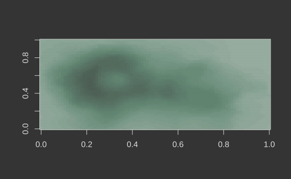

<!-- README.md is generated from README.Rmd. Please edit that file -->

# thematic

<!-- badges: start -->

[](https://CRAN.R-project.org/package=thematic)
[](https://www.tidyverse.org/lifecycle/#experimental)
<!-- badges: end -->

Theme **ggplot2**, **lattice**, and **base** graphics based on a few
simple settings.

## Installation

**thematic** is not yet available on [CRAN](https://CRAN.R-project.org),
but you can install it now with:

``` r
remotes::install_github("cpsievert/thematic")
library(thematic)
```

## Getting started

### Main colors

``` r
library(ggplot2)
p <- ggplot(faithfuld, aes(waiting, eruptions, z = density)) +
  geom_raster(aes(fill = density)) + 
  geom_contour()
```

``` r
thematic_begin(bg = "darkblue", fg = "skyblue", accent = "orange")
p
```


``` r
thematic_begin("#444444", "#e4e4e4", "#749886")
p
```


``` r
lattice::show.settings()
```


``` r
image(volcano)
image(volcano, col = thematic_current("sequential"))
```



### Fonts

There are two main controls for fonts currently: `family` and `scale`.
`scale` (defaults to 1) is multiplied against all relevant font sizes.
If `family` references a font that doesn’t exist on the system, but the
font is available on [Google Fonts](https://fonts.google.com/),
**thematic** will try to download and register the font files for you
(as long as `register = TRUE`). Moreover, if you have the **showtext**
package installed (prior to calling `thematic_begin()`), then the fonts
should “just work”.

``` r
font <- font_spec(family = "Oxanium", scale = 1.25, register = TRUE)
thematic_begin("black", "white", font = font)
p
```


``` r
thematic_end()
p
```


## Caveats

1.  To ensure **thematic** works properly in **knitr**/**rmarkdown**,
    you currently need to put `library(thematic)` (or
    `knitr::opts_knit$set("global.par" = TRUE)`) in a code chunk *before
    other code chunks* that call `thematic_begin()`.
2.  **thematic** currently works best with the development version of
    **ggplot2**, so you may want to consider installing
    `remotes::install_github("tidyverse/ggplot2")`.
