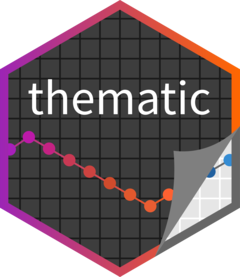
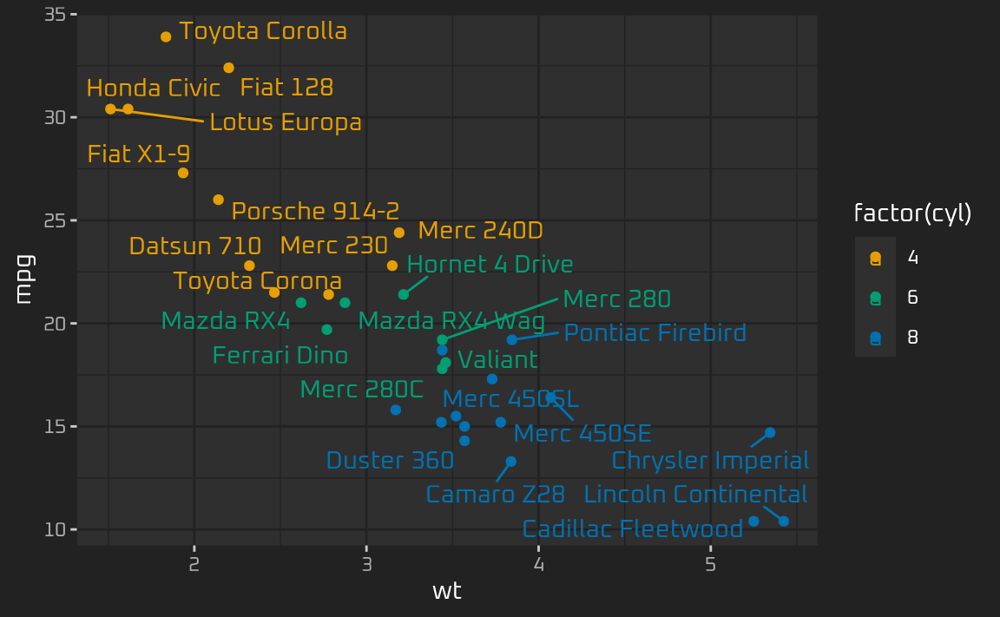
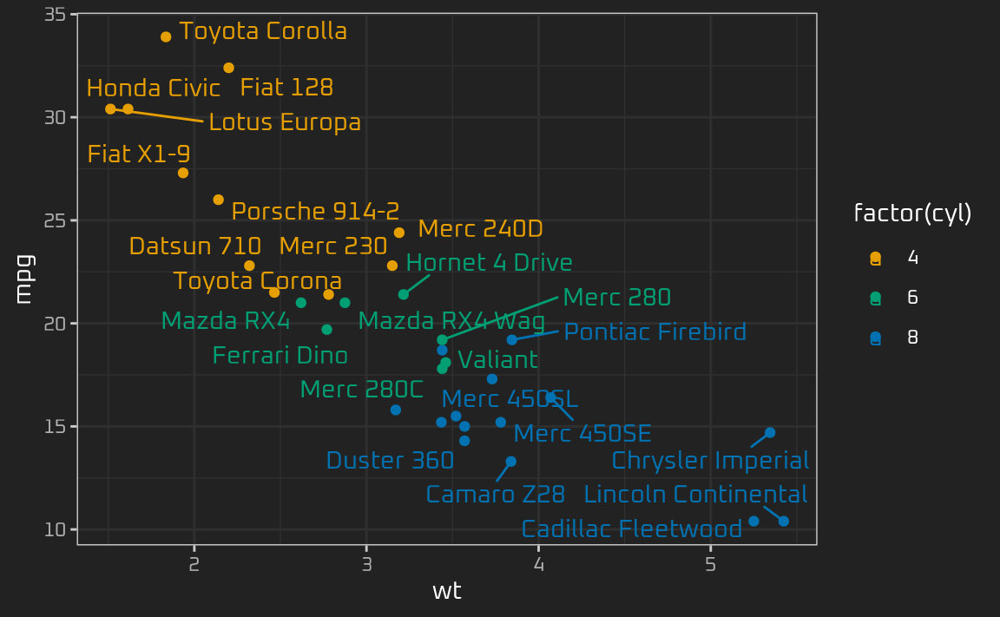

<!-- README.md is generated from README.Rmd. Please edit that file -->

# thematic <a href='https://rstudio.github.io/thematic/'></a>

<!-- badges: start -->

[](https://github.com/rstudio/thematic)
[](https://CRAN.R-project.org/package=thematic)
[](https://lifecycle.r-lib.org/articles/stages.html)
<!-- badges: end -->

Simplified theming of `{ggplot2}`, `{lattice}`, and `{base}` R graphics.
In addition to providing a [centralized
approach](https://rstudio.github.io/thematic/articles/custom.html) to
styling R graphics, `{thematic}` also enables [automatic
styling](https://rstudio.github.io/thematic/articles/auto.html) of R
plots in Shiny, R Markdown, and RStudio.

## Installation

Install the stable release of `{thematic}` on
[CRAN](https://CRAN.R-project.org) with:

``` r
install.packages("thematic")
```

[Auto theming in
Shiny](https://rstudio.github.io/thematic/articles/auto.html#shiny)
requires `{shiny}` 1.5.0 or higher:

``` r
install.packages("shiny")
```

[Auto theming in R
Markdown](https://rstudio.github.io/thematic/articles/auto.html#rmd)
requires `{rmarkdown}` 2.7 or higher:

``` r
install.packages("rmarkdown")
```

Using themes with [custom
fonts](https://rstudio.github.io/thematic/articles/fonts.html) works
best if you have `{showtext}` and/or `{ragg}` installed.

``` r
install.packages("showtext")
install.packages("ragg")
```

## Overview

`{thematic}`’s [auto
theming](https://rstudio.github.io/thematic/articles/auto.html) gives R
plots the ability to style themselves inside [Shiny](#shiny) (via CSS),
[RStudio](#rstudio) (via [RStudio
themes](https://support.posit.co/hc/en-us/articles/115011846747-Using-RStudio-Themes)),
and [R Markdown](#rmarkdown) (via
[`{bslib}`](https://rstudio.github.io/bslib/)).

### Shiny

Call `thematic_shiny()` before launching a Shiny app to enable
`{thematic}` for every `plotOutput()` inside the app. If no values are
provided to `thematic_shiny()`, each `plotOutput()` uses the app’s CSS
colors to inform new R plotting defaults. If the app uses [Google
Fonts](https://fonts.google.com/) (and you have `{showtext}` and/or
`{ragg}` installed), you may safely provide `font = "auto"` to
`thematic_shiny()`, which also translates CSS fonts to R. Here’s an
example with the [Pacifico](https://fonts.google.com/specimen/Pacifico)
font:

``` r
library(shiny)
library(ggplot2)
library(thematic)
# In order for auto/custom fonts to work properly, you'll want
# either the ragg (or showtext) package installed
library(ragg)

# If you want `{ragg}` to handle the font rendering in a Shiny app
options(shiny.useragg = TRUE)

# Call thematic_shiny() prior to launching the app, to change
# R plot theming defaults for all the plots generated in the app
thematic_shiny(font = "auto")

ui <- fluidPage(
  # bslib makes it easy to customize CSS styles for things
  # rendered by the browser, like tabsetPanel()
  # https://rstudio.github.io/bslib
  theme = bslib::bs_theme(
    bg = "#002B36", fg = "#EEE8D5", primary = "#2AA198",
    # bslib also makes it easy to import CSS fonts
    base_font = bslib::font_google("Pacifico")
  ),
  tabsetPanel(
    type = "pills",
    tabPanel("ggplot", plotOutput("ggplot")),
    tabPanel("lattice", plotOutput("lattice")),
    tabPanel("base", plotOutput("base"))
  )
)

server <- function(input, output) {
  output$ggplot <- renderPlot({
    ggplot(mtcars, aes(wt, mpg, label = rownames(mtcars), color = factor(cyl))) +
      geom_point() +
      ggrepel::geom_text_repel()
  })
  output$lattice <- renderPlot({
    lattice::show.settings()
  })
  output$base <- renderPlot({
    image(volcano, col = thematic_get_option("sequential"))
  })
}

shinyApp(ui, server)
```


### RStudio

Call `thematic_on()` before generating plots inside RStudio to have all
subsequent plots shown in the “Plots” viewing pane to reflect your
RStudio theme. Note that `thematic_on()` enables `{thematic}` for the
remainder of the R session, but you can use `thematic_off()` to disable
([or `thematic_theme()` for one-off use of
`{thematic}`](https://rstudio.github.io/thematic/articles/scope.html#one-time-use)).
Here’s an example of how `{thematic}` can intelligently adapt each plot
to the current RStudio theme:


### R Markdown

Call `thematic_rmd()` before generating plots inside R Markdown to have
all subsequent plots within the document reflect the relevant theme. In
a static (i.e., non-`runtime: shiny`) R Markdown context, auto-theming
only works with [`{bslib}`-powered
`rmarkdown::html_document()`](https://rstudio.github.io/bslib/#r-markdown-usage)
(as in the example below), but in other situations you may also [provide
colors and fonts](#custom) explicitly to `thematic_rmd()`.


### Custom theming

By default, `{thematic}` attempts to detect the relevant background,
foreground, and accent colors. However, you may also specify these
settings more directly by providing relevant color and fonts directly to
`thematic_on()` (or `thematic_shiny()`/`thematic_rmd()`).

``` r
library(ggplot2)
thematic::thematic_on(bg = "#222222", fg = "white", accent = "#0CE3AC", font = "Oxanium")

ggp <- ggplot(mtcars, aes(wt, mpg, label = rownames(mtcars), color = factor(cyl))) +
  geom_point() +
  ggrepel::geom_text_repel()
ggp
```



`{thematic}` works by setting new global defaults that can always be
overridden with plot-specific `theme()`-ing code:

``` r
ggp + theme(text = element_text(colour = "purple"))
```


To use a “complete” `{ggplot2}` theme with `{thematic}` (e.g.,
`theme_bw()`, `theme_minimal()`, etc), use `theme_set()` to set the
theme globally. This way `{thematic}` has the opportunity to preserve
the complete theme’s styling semantics when changing global defaults
(e.g., `theme_bw()` uses the same fill color for the panel and plot
background, which is semantically different from the `theme_gray()`
default):

``` r
theme_set(theme_bw())
ggp
```



In addition to setting new defaults for main colors and fonts,
`{thematic}` also sets defaults for `qualitative` (and `sequential`)
colorscales. See the [custom themes
article](https://rstudio.github.io/thematic/articles/custom.html) to
learn more about how to customize those defaults.

## Learn more

- See the [auto theming
  article](https://rstudio.github.io/thematic/articles/auto.html) to
  gain a more detailed understanding of how auto theming make styling R
  plots easier in Shiny, R Markdown, and RStudio.
- See the [custom themes
  article](https://rstudio.github.io/thematic/articles/custom.html) for
  more on `{thematic}`’s theming options as well as how they interact
  with `{ggplot2}`, `{lattice}`, and `{base}`.
- See the [fonts
  article](https://rstudio.github.io/thematic/articles/fonts.html) for
  more on using Google Fonts with `{thematic}`.
- See the [scoping
  article](https://rstudio.github.io/thematic/articles/scope.html) for
  more about scoping `{thematic}` to individual plots.

## Run some examples

Below is a link to an **RStudio Cloud** instance with some ready to run
`{thematic}` examples:

<div>

<a href="https://rstudio.cloud/project/1208127" target="_blank">

</a>

</div>

## Code of Conduct

`{thematic}` is released with a [Contributor Code of
Conduct](https://contributor-covenant.org/version/2/0/CODE_OF_CONDUCT.html).
By
[contributing](https://github.com/rstudio/thematic/blob/main/CONTRIBUTING.md)
to this project, you agree to abide by its terms.
