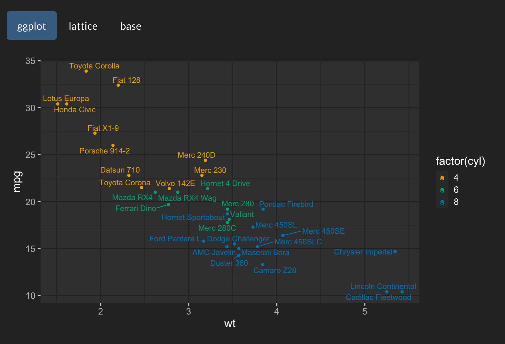
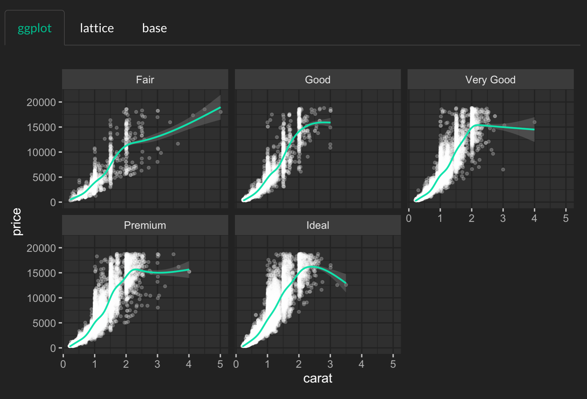
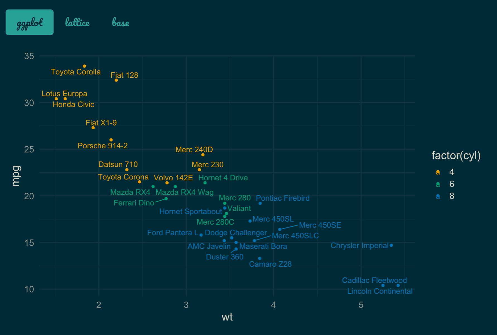
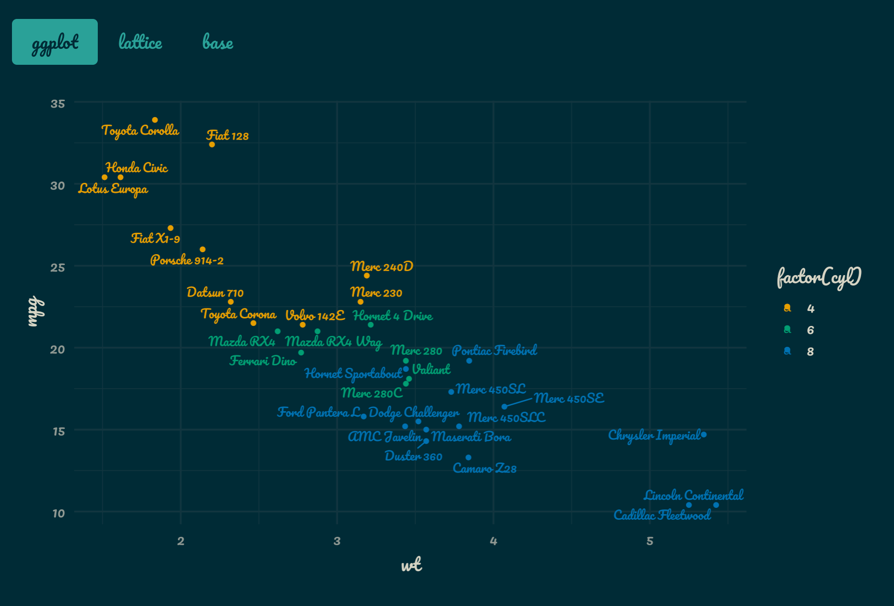
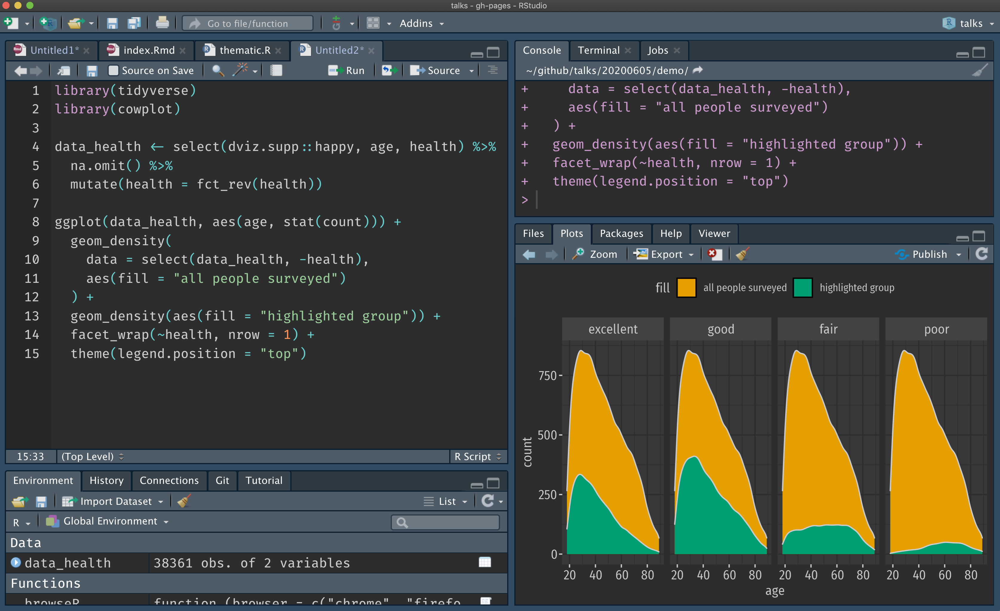

```{r, include = FALSE}
library(thematic)
knitr::opts_chunk$set(
  message = FALSE,
  collapse = TRUE,
  comment = "#>",
  out.width = "70%",
  fig.align = 'center',
  fig.width = 6,
  fig.asp = 0.618,  # 1 / phi
  fig.show = "hold"
)
include_vimeo <- function(id, width = "100%", height = "400") {
  url <- sprintf("https://player.vimeo.com/video/%s?title=0&byline=0&portrait=0", id)
  htmltools::tags$iframe(
    src = url,
    width = width,
    height = height,
    frameborder = "0",
    seamless = "seamless",
    webkitAllowFullScreen = NA,
    mozallowfullscreen = NA,
    allowFullScreen = NA
  )
}
```

The most magical aspect of **thematic** is its auto theming capabilities, which gives R plots to ability to style themselves in [Shiny](https://rstudio.github.io/thematic/articles/auto.html#shiny) (via CSS), [R Markdown](https://rstudio.github.io/thematic/articles/auto.html#rmd) (via **bootstraplib**), and [RStudio](https://rstudio.github.io/thematic/articles/auto.html#rstudio) (via [RStudio themes](https://support.rstudio.com/hc/en-us/articles/115011846747-Using-RStudio-Themes)). To gain a sense for how auto theming works, it's recommended you read through the next section, which walks through several variants on a basic Shiny app, and demonstrates how auto theming allows the R plots to be reactive to the changes in CSS styling. Also, as discussed in [other scenarios](#other), it possible to configure the information **thematic** uses for auto theming, but you can also opt-out of auto theming by providing desired colors and fonts to **thematic** (as discussed on [custom themes](custom.html)).

## Shiny {#shiny}

One frustrating thing about styling Shiny apps is that R plots know nothing about CSS. That means, if you write [custom CSS to style the app]((https://shiny.rstudio.com/articles/css.html)), you'll likely also want to translate those same styles to the R graphics. You may have never noticed this problem before if you just use the default styles in both systems because they're quite similar. Here's the default styles in a Shiny app with a few R plots inside a `tabsetPanel()`:

```r
library(shiny)
library(ggplot2)

tabs <- tabsetPanel(type = "pills",
  tabPanel("ggplot", plotOutput("ggplot")),
  tabPanel("lattice", plotOutput("lattice")),
  tabPanel("base", plotOutput("base"))
)

ui <- fluidPage(tabs)

server <- function(input, output) {
  output$ggplot <- renderPlot({
    ggplot(mtcars, aes(wt, mpg, label = rownames(mtcars), color = factor(cyl))) +
      geom_point() +
      ggrepel::geom_text_repel()
  })
  output$lattice <- renderPlot({
    lattice::show.settings()
  })
  output$base <- renderPlot({
    image(volcano, col = thematic_get_option("sequential"))
  })
}

shinyApp(ui, server)
```

```{r, echo = FALSE, fig.align='left', out.width="82%"}
knitr::include_graphics("tabsets.svg")
```

By bringing in a new set of CSS rules, say the [darkly](https://bootswatch.com/darkly/) [**shinytheme**](http://rstudio.github.io/shinythemes/), the difference in CSS vs R styles becomes much more apparent:

```r
ui <- fluidPage(
  tabs, theme = shinythemes::shinytheme("darkly")
)
shinyApp(ui, server)
```

```{r, echo = FALSE}
knitr::include_graphics("tabsets-darkly.png")
```

By activating **thematic** auto coloring (as shown below), R plot(s) generated by the Shiny app gain new color defaults based on the surrounding CSS styles. This works because, at plot time, **thematic** grabs CSS styles from the plot(s) HTML container (via `shiny::getCurrentOutputInfo()`)[^1] and uses that info to set new R styling defaults.

[^1]: If you're a **shiny** developer and wish to add similar auto theming capabilities to a custom output, you can add a `.shiny-report-theme` class to the output container to obtain styles via `getCurrentOutputInfo()`. And similarly, if you're an **htmlwidgets** developer, you can just set `reportTheme = TRUE` in `htmlwidgets::shinyWidgetOutput()`.

```r
thematic::thematic_shiny()
shinyApp(ui, server)
```

```{r, echo = FALSE}

```

From the **ggplot2** example above, we can see `thematic_on()` has done the following for us:

* Set new `ggplot2::theme()`-ing defaults based on the background and foreground colors (as well as appropriate mixtures of these colors for the panel background).
* Set a new color-blind safe default for `scale_color_discrete()` (and `scale_fill_discrete()`).

Now, if we change our `tabsetPanel()` from `type="pills"` to `type="tabs"` and look at a couple other **ggplot2** examples, we can see that `thematic_on()` does a few more things:

* Sets new `geom_*()` defaults using the new foreground (in this case, `geom_point()`'s `color`) and accent color (in this case, `geom_smooth()`'s color).
  * The accent color comes from the hyperlink color of the plot's HTML container. It just so happens that this [darkly](https://bootswatch.com/darkly) theme colors `type="tabs"` the same as hyperlinks, but `type="pills"` is colored differently.

```{r, echo = FALSE}

```

Also:

* Uses the background, foreground, and accent colors to construct a new default for `scale_fill_continuous()` (and `scale_color_continuous()`).

```{r, echo = FALSE}
knitr::include_graphics("tabsets-geom-raster.png")
```

Keep in mind that **thematic** works by changing _global defaults_, so you can always [customize](custom.html) with plot-specific code (e.g., by adding `theme()` to a plot object `p`). That said, to use **thematic** with a different complete **ggplot2** theme (e.g., `theme_minimal()`, `theme_bw()`, etc), you should do so by setting that theme globally.

```r
theme_set(theme_minimal())
shinyApp(ui, server)
```

```{r, echo = FALSE}
knitr::include_graphics("tabsets-darkly-thematic-minimal.png")
```

Since **thematic** knows the CSS rules on the plot's HTML container, auto theming works regardless of how the HTML is actually styled. That said, consider using the new [**bootstraplib** package](https://rstudio.github.io/bootstraplib/) to theme your Shiny apps (and R Markdown docs). It provides a rich set of tools for influencing Bootstrap CSS from R, including convenience functions for [setting the main colors (and fonts)](https://rstudio.github.io/bootstraplib/articles/recipes.html):

```r
library(bootstraplib)
bs_theme_new()
bs_theme_base_colors(bg = "#002B36", fg = "#EEE8D5")
bs_theme_accent_colors(primary = "#2AA198")
bs_theme_fonts("Pacifico")
```

In this case, we've set the font family for this **bootstraplib** theme to be [Pacifico](https://fonts.google.com/specimen/Pacifico), which is a [Google Font](https://fonts.google.com). Therefore, in order for the browser to be able to render this font, we need to [import it](https://developers.google.com/fonts/docs/getting_started). For simplicity, this code imports the font via a remote URL, but it's recommended to use local font files (for hosting reasons). The [**gfonts** package](https://github.com/dreamRs/gfonts) makes it really easy to download and use Google Fonts locally in Shiny and R Markdown.

```r
ui <- fluidPage(
  tabs, bootstrap(),
  tags$link(href="https://fonts.googleapis.com/css?family=Pacifico", rel="stylesheet")
)
shinyApp(ui, server)
```

```{r, echo = FALSE}

```

As shown in the image above, text rendered by the browser (i.e., `tabsetPanel()`'s titles) now uses the Pacifico font, but the R plots are still using the default font because, by default, `thematic_shiny()` only enables automatic colors. To enable auto fonts, set `font = "auto"`; and when doing so, make sure the font to be rendered is either a font already supported by R, or is Google Font and the **showtext** package is installed (learn more in the [fonts article](fonts.html)).

```r
library(showtext)
thematic_shiny(font = "auto")
shinyApp(ui, server)
```

```{r, echo = FALSE}

```

```{r, echo = FALSE}
knitr::include_graphics("tabsets-custom-fonts-lattice.png")
```

**thematic** also works great with **bootstraplib**'s realtime theming widget. This interactive widget influences the CSS on the page, so as long as thematic's auto theming enabled, those CSS changes automatically influence the R plot styling. Note how here we still have both auto fonts and colors, which means that as long as we choose Google Fonts (and/or fonts already known to R), the R plots can automatically render them.

```r
# The theming widget could also be added to our mini example with bs_themer(),
# but this demo app demonstrates a wider range of examples
bs_theme_preview()
```

```{r, echo = FALSE}
include_vimeo("411238499")
```

## R Markdown {#rmd}

Auto theming can also work with `rmarkdown::html_document()`. The main catch is that, if R plots are not generated [via Shiny](https://bookdown.org/yihui/rmarkdown/shiny-documents.html), then any custom styling must be done via the **bootstraplib** package in order for **thematic** to know about it. In the example below, we set a custom background, foreground, and accent color via **bootstraplib**; then use `thematic_rmd()` to apply automatic coloring to every R plot generated in the R Markdown document.

```{r, echo = FALSE, out.width="95%"}
knitr::include_graphics("html-document.svg")
```

Auto theming doesn't necessarily work for non-HTML output formats. In that case, provide the document's colors and fonts either directly to `thematic_rmd()` or to `auto_config()`. To learn more about various options for 

```{r, echo = FALSE, out.width="95%"}
knitr::include_graphics("tufte.svg")
```

## RStudio {#rstudio}

Here's a **ggplot2** plot inside the RStudio IDE before **thematic** is enabled. Note the colors in the IDE are based on the Tomorrow Night 80s [RStudio Theme](https://support.rstudio.com/hc/en-us/articles/115011846747-Using-RStudio-Themes) and the editor's font is [FiraCode](https://github.com/tonsky/FiraCode).

```{r, echo = FALSE, out.width="95%"}
knitr::include_graphics("rstudio.png")
```

After calling `thematic_on(font = "Fira Sans Condensed")` to enable automatic colors and request the [Fira Sans Condensed](https://fonts.google.com/specimen/Fira+Sans+Condensed) Google Font, the colors in the Plots viewer pane now match the RStudio theme[^2], and the fonts nicely complement the editor's font.

```{r, echo = FALSE, out.width="95%"}

```

By the way, rendering of Google Fonts in RStudio requires a special setup that's discussed in the [fonts article](fonts.html#rstudio).

[^2]: Auto detection of background and foreground should always work in RStudio, but `accent='auto'` is currently limited to non-custom [RStudio themes](https://support.rstudio.com/hc/en-us/articles/115011846747-Using-RStudio-Themes). Moreover, `font='auto'` is fully supported on RStudio Server Pro (1.4 or higher), but may not work on RStudio Desktop.

## Other scenarios {#other}

As the [R Markdown](#rmd) section already eluded to (in reference to non-HTML output formats), **thematic**'s auto theming won't know what styles to use in every scenario. In these scenarios, you have the following options:

* Avoid `'auto'` values entirely by providing the desired colors and fonts directly to `thematic_on()`. The next article, [Custom Themes](custom.html), discusses this option in depth.
* Allow auto theming to "fail", meaning that **thematic** effectively has no effect on the visual output.
* Use `auto_config()` and `auto_config_set()` to set "fallbacks" for `'auto'` values. For example:

```{r, echo = FALSE}
library(ggplot2)
library(thematic)
```

```{r}
config <- auto_config(bg = "black", fg = "white", accent = "purple")
auto_config_set(config)
thematic_on()
ggplot(faithfuld, aes(waiting, eruptions)) + 
  geom_raster(aes(fill = density))
```

The main use case for `auto_config()` is for developers of a custom rmarkdown output document that wish to provide an auto theming experience for users of the document (see `auto_config()` for more details). However, there may also be scenarios where more control over the set and priority of information that `auto_resolve_theme()` uses to resolve `'auto'` values. This can be done via the `priority` argument of `auto_config()`. The default `priority` is:

1. `shiny::getCurrentOutputInfo()` (`"shiny"`)
2. `auto_config_get()` (`"config"`)
3. `bootstraplib::bs_theme_get_variables()` (`"bootstraplib"`)
4. `rstudioapi::getThemeInfo()` (`"rstudio"`)


```{r, echo = FALSE}
thematic_off()
```
