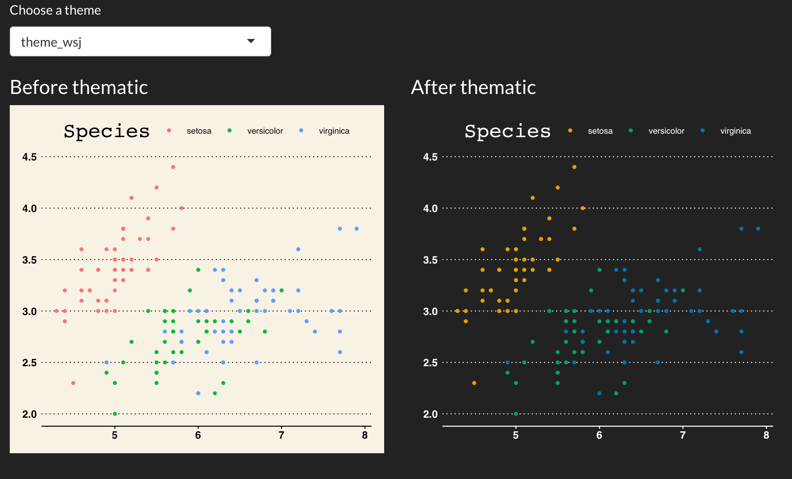

```{r, include = FALSE}
library(thematic)
set.seed(101)
knitr::opts_chunk$set(
  message = FALSE,
  collapse = TRUE,
  comment = "#>",
  out.width = "70%",
  fig.align = 'center',
  fig.width = 6,
  fig.asp = 0.618,  # 1 / phi
  fig.show = "hold",
  dev = "ragg_png"
)
#knitr::knit_hooks$set(optipng = knitr::hook_optipng)
#knitr::opts_chunk$set(optipng = "")
```

In the [auto theming article](auto.html), we learned that calling `thematic_on()` with no arguments applies auto coloring and that calling `thematic_on(font = "auto")` adds in automatic fonts. After reading that article, you may be left thinking, "What if auto theming doesn't theme stuff exactly the way I want it to?" This article helps address that question by demonstrating how to do customized "high-level" theming with **thematic** as well as "lower-level" theming targeted specifically at **ggplot2**, **lattice**, and **base** graphics. In other words, we'll first learn how to use **thematic**'s theming interface to set global defaults, then learn how to override those global defaults in plot-specific code.

## Theming with **thematic**

### Main colors

From the function signature of `thematic_on()`, we can see the three main colors of a **thematic** theme, which all default to a special value of `"auto"`.

```r
thematic_on(
  bg = "auto", fg = "auto", accent = "auto", font = NA,
  sequential = sequential_gradient(), qualitative = okabe_ito()
)
```

However, these arguments also accept any valid R (or CSS) color string. So, to "opt-out" of auto coloring, just specify the colors: 

```{r}
library(ggplot2)
thematic_on(bg = "#222222", fg = "white", accent = "purple")
ggsmooth <- ggplot(mtcars, aes(wt, mpg)) + geom_point() + geom_smooth()
ggsmooth
```

Similar to how `font = NA` prevents **thematic** from changing any font defaults, `accent = NA` prevents accent color defaults (e.g., `geom_smooth()`'s `color`) from changing.

```{r}
thematic_on(bg = "#222222", fg = "white", accent = NA)
ggsmooth
```

### Sequential colorscales

The `sequential` argument is used to set a new default for sequential color scales (i.e., `scale_fill_continuous()` & `scale_color_continuous()`). Its default value, `sequential_gradient()`, defines a color gradient of `fg` -> `accent` -> `bg`:

```{r}
thematic_on(bg = "#222222", fg = "white", accent = "purple")
ggcontour <- ggplot(faithfuld, aes(waiting, eruptions, z = density)) +
  geom_raster(aes(fill = density)) +
  geom_contour()
ggcontour
```

To flip the direction of the gradient to `bg` -> `accent` -> `fg`

```{r}
thematic_on(
  bg = "#222222", fg = "white", accent = "purple",
  sequential = sequential_gradient(fg_low = FALSE)
)
ggcontour
```

If you look carefully, the endpoints of the gradient actually use a mixture of `bg`/`fg` and `accent`. The weighting of those mixtures can also be controlled via `fg_weight` and `bg_weight`. Here we make sure the gradient's starts at the `bg` color and ends at the `accent`. 

```{r}
thematic_on(
  bg = "#222222", fg = "white", accent = "purple",
  sequential = sequential_gradient(fg_low = FALSE, fg_weight = 0, bg_weight = 1)
)
ggcontour
```

If you don't want `sequential` to be based on `accent`/`bg`/`fg`, you can also provide a vector of color codes defining the gradient.

```{r}
thematic_on(bg = "#222222", fg = "white", accent = "white", sequential = hcl.colors(10))
ggcontour
```

Similar to how we opted out of new `accent` defaults, we can also opt-out of new `sequential` defaults

```{r}
thematic_on(bg = "#222222", fg = "white", accent = "white", sequential = NA)
ggcontour
```

### Qualitative colorscales

In addition to sequential colorscales, **thematic** also sets new defaults for qualitative (i.e., discrete) color scales based on the `qualitative` argument. The default, `okabe_ito()`, is a great color-blind safe option, but `qualitative` can be set to any vector of color codes. Here's another good color-blind safe palette from <https://colorbrewer2.org/#type=qualitative&scheme=Dark2>

```{r}
thematic_on(
  bg = "#222222", fg = "white", qualitative = RColorBrewer::brewer.pal(8, "Dark2")
)
ggplot(mtcars, aes(wt, mpg, color = factor(cyl))) + geom_point()
```

In the event that a **ggplot2** plot requires more colors than provided, it will fallback to the usual `scale_[color/fill]_hue()` behavior:

```{r}
ggplot(mtcars, aes(wt, mpg, color = row.names(mtcars))) + geom_point()
```

However, for **base** and **lattice** graphics, the qualitative colorscale (i.e., `palette()`) is recycled:

```{r}
with(mtcars, plot(wt, mpg, col = seq_len(nrow(mtcars))))
```

Again, to prevent **thematic** from setting any new defaults for qualitative colorscales, provide an `NA` value

```{r}
thematic_on(
  bg = "#222222", fg = "white", qualitative = NA
)
ggplot(mtcars, aes(wt, mpg, color = factor(cyl))) + geom_point()
```

### Fonts

The `font` argument accepts a character string specifying either a font already know to R or a [Google Font](https://fonts.google.com). When a (new) Google Font is requested, **thematic** can automatically download, register, and cache (prior to plotting) so that Google Fonts "just work" if the **showtext** package is installed. In some cases, some additional setup may be required to get Google Fonts rendering properly --- see the [fonts article](fonts.html) for more info.

```{r}
thematic_on(bg = "#222222", fg = "white", font = "Oxanium")
ggsmooth
```

`font` also accepts a `font_spec()` object which, among other things, makes it easy to multiply all the font sizes by a scalar multiple:

```{r}
thematic_on(bg = "#222222", fg = "white", font = font_spec("Oxanium", scale = 2))
ggsmooth
```


## Theming with **ggplot2**

### Complete themes

Complete **ggplot2** themes are `theme()` objects that fully specify every possible `theme()` element. The default **ggplot2** theme, `theme_gray()`, is a complete theme, and **ggplot2** provides some other useful complete themes such as `theme_bw()`, `theme_minimal()`, and `theme_classic()`. As we saw in the auto theming article, **thematic** can play nicely with complete themes so long as they're set globally. This is because plot-specific code overrides the defaults that **thematic** sets, and so by adding a complete theme to a plot (i.e., `ggsmooth + theme_classic()`) it would override all the `theme()`-specific defaults set by **thematic**, which likely isn't what you want.

```{r}
ggplot2::theme_set(ggplot2::theme_classic())
thematic_on(bg = "#222222", fg = "white")
ggsmooth
# Now go back to the default
ggplot2::theme_set(ggplot2::theme_gray())
```

Other **ggplot2** extension packages such as **ggthemes** also provide useful complete themes. The image below links to a Shiny app that allows you to preview how various **ggthemes** themes look both before and after **thematic** in a Shiny app with some custom CSS.

```{r, echo = FALSE, out.width="100%", fig.link = "https://testing-apps.shinyapps.io/ggthemes"}

```

### Partial themes

`thematic_on()` sets a new "complete" `theme()` default based on `bg`, `fg`, and `font` (based on a modified version of `theme_gray()`). Since this theme is "complete", you probably don't want to mix it with other complete themes (e.g., `theme_bw()`), but you can definitely override particular aspects with `theme()`.

```{r}
thematic_on(bg = "#222222", fg = "white")
p <- ggplot(mtcars, aes(wt, mpg)) + 
  geom_point() +
  facet_wrap(~cyl)
p + theme(strip.background = element_rect(fill = "purple"))
```

By the way, it's worth noting that thematic uses a fairly arbitrary amount of mixture between the `fg` and `bg` to set the theme. If you wanted different mixture(s) of `fg` and `bg`, then `thematic_get_mixture()` is useful:

```{r}
my_theme <- theme(
  panel.background = element_rect(fill = thematic_get_mixture(0.6)),
  strip.background = element_rect(fill = thematic_get_mixture(0.3)),
  strip.text = element_text(color = thematic_get_mixture(1))
 )
p + my_theme
```

### Geom defaults

For each relevant `Geom` (e.g., `GeomPoint`), new `Geom$default_aes` defaults are set (based on `bg`, `fg`, `accent`, and `font`). Grayscale colors (e.g., `GeomPoint$default_aes$color`) are assigned a mixture of `bg` and `fg` whereas non-grayscale colors (e.g., `GeomSmooth$default_aes$color`) are assigned the `accent` color. It's important to note these are just global defaults that only take effect if the aesthetic hasn't been specified:

```{r}
ggplot(mtcars, aes(wt, mpg)) + 
  geom_point(color = "red") +
  facet_wrap(~cyl)
```

### Scale defaults

`thematic_on()` sets a new `scale_fill_continuous()` and `scale_color_continuous()` defaults (based on `sequential`). See the previous section for an extensive discussion on how `sequential` works and note that adding a relevant (continuous) scale renders `sequential` irrelevant:

```{r}
ggplot(faithfuld, aes(waiting, eruptions, z = density)) +
  geom_raster(aes(fill = density)) +
  scale_fill_gradient2(midpoint = 0.02)
```

It also defines new `scale_fill_discrete()` and `scale_color_discrete()` defaults (based on `qualitative`). As with `sequential` colorscales, adding a relevant (discrete) scale renders `qualitative` irrelevant:

```{r}
ggplot(economics_long) +
  geom_line(aes(date, value01, color = variable)) +
  scale_color_brewer(type = "qual")
```

### Third party extensions

As a side note, when it comes to third party **ggplot2** extension packages, **thematic** should work as expected ([let us know if it doesn't](https://github.com/rstudio/thematic)) as long as those extension packages aren't hard coding defaults in un-expected ways.

```{r, fig.asp = 0.8, fig.width = 8, out.width="85%"}
library(GGally)
ggpairs(iris, aes(color = Species))
```

## Theming with lattice

**thematic** also works with **lattice**; however, beware that theming decisions are made so that **lattice** plots look somewhat similar to **ggplot2** (i.e. panel background is a mixture of `bg` and `fg` instead of just `bg`). Also, similar to **base** graphics, **lattice** doesn't have a global distinction between a `qualitative` and `sequential` colorscales, so `sequential` isn't used in **lattice**. Instead, for consistency with **lattice**'s default, the "regions" colorscale interpolates between `qualitative[1]`, `bg`, and `qualitative[2]`.

(Btw, for **lattice**, `accent` may be of length 2. The first is used for 'stroke' and the second for 'fill').

```{r}
# accent may be of length 2 (stroke and fill)
thematic_on(bg = "#222222", fg = "white", accent = c("purple", "red"))
library(lattice)
show.settings()
```

It might seem strange to have `bg` define the middle of the color gradient, but it's intentional so that it works well with `lattic::contourplot()` (or other cases where text wants to be placed on top of the gradient):

```{r}
library(stats)
attach(environmental)
ozo.m <- loess((ozone^(1/3)) ~ wind * temperature * radiation,
       parametric = c("radiation", "wind"), span = 1, degree = 2)
w.marginal <- seq(min(wind), max(wind), length.out = 50)
t.marginal <- seq(min(temperature), max(temperature), length.out = 50)
r.marginal <- seq(min(radiation), max(radiation), length.out = 4)
wtr.marginal <- list(wind = w.marginal, temperature = t.marginal,
        radiation = r.marginal)
grid <- expand.grid(wtr.marginal)
grid[, "fit"] <- c(predict(ozo.m, grid))
contourplot(fit ~ wind * temperature | radiation, data = grid,
            cuts = 10, region = TRUE,
            xlab = "Wind Speed (mph)",
            ylab = "Temperature (F)",
            main = "Cube Root Ozone (cube root ppb)")
detach()
```

## Theming with base

Similar to **lattice**, **base** R graphics doesn't have a global distinction between a `qualitative` and `sequential` colorscales, it just has `palette()` (which is closest, semantically, to `qualitative`):

```{r}
par(mfrow = c(1, 2))
hist(rnorm(100))
plot(rep(1:5, each = 5), rep(1:5, 5), col = 1:25, pch = 1:25, cex = 5)
```

However, do know that you can supply the current sequential colorscale to individual plotting functions by doing something like `col = thematic_get_option("sequential")`:

```{r}
par(mfrow = c(1, 2))
image(volcano)
image(volcano, col = thematic_get_option("sequential"))
```
